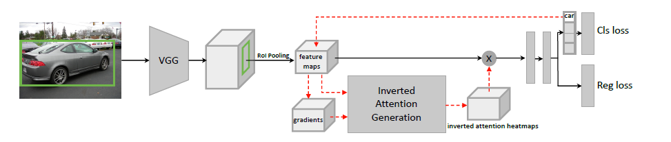

# Inverted Attention

> https://arxiv.org/abs/1903.12255



> 这是一个咕咕咕了很长时间的一个project,当时大三下的时候柯老师让我实现一下，后来因为忙着保研一直没有做,不过现在看来我当时也确实没有这个能力做好,主要有两点
> * 对 `register_hook` 机制的不熟悉
> * 对 fasterRcnn 的细节真的不熟悉

### Introduction

本项目很大程度上依赖了`torchvision.models.detection` 中的实现, 原论文中说了Inverted Attention是一个通用的方法,基本可以嵌入在主流的Two stage 和 One stage 的方法中，所以本项目的Inverted Attention 是建立在fasterrcnn_resnet50_fpn 基础上的

### Usage

主要实现有很详细的注释,可以下载好mscoco2017之后直接
```
python IAN.py
```
测试模型的实现


### problem

* 在原文中(可能是我看的不是很仔细),没有怎么看到spatial-wise threshold 和 channel-wise threshold的 设置，代码中我是自己打印观察了一下经过roi_pool 之后的feature的gradients 之后手动设置了一下

* 可能在model.zero_grad()和梯度流处理的细节上我还是有点迷糊，我的理解是在Inverted Attention Generation的过程中我们都需要记录梯度,只要生成heatmaps就好

### Thiniking

感觉这个方法很简洁,扩展性很好,思路上来说和我之前看过的GradCAM在实现上很像.

> Different from the original detector network that only focuses on the small parts of objects, the neural network with IA puts more attention on complementary spatial parts of the original network,feature channels and even the context.

这句话我是印象很深刻的


